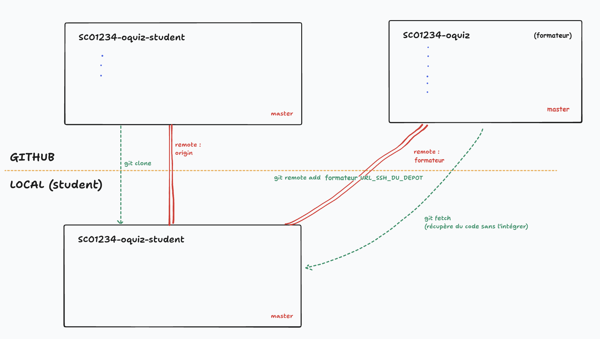

# Gitflow

Objectif : 
- Accepter le `ochallenge` le premier jour pour générer son propre dépôt à son nom, et le cloner.
- À partir du deuxième jour, et **jusqu'à la fin du projet**, mettre à jour chaque jour son dépôt à partir du code "formateur" avant d'entamer le challenge.
- Coder chaque challenge sur une **branche dédiée**, afin de créer des Pull Request et se (faire) relire facilement.

Avantage :
- un seul dépôt pour tout le projet plutôt que de multiple ochallenge redondant
- apprendre à gérer ses branches et sauvegarder son code sur des branches dédiées
- possibilité de créer des Pull Request pour se relire

🚫 Ne JAMAIS coder sur la branche `master`
💡 `master` = miroir du formateur → on ne travaille jamais dessus
💡 `branche` = votre espace de travail

## 1. Ouvrir votre dépôt

- Ouvrir **votre dépôt** dans VSCode (pas celui du formateur) avec un terminal à disposition.
- Fermer éventuellement les onglets ouverts (ça va switcher chéri !).

## 2. (⚠️ À faire une seule fois) Ajouter le remote du formateur

A faire **une seule fois pour la saison**, ajouter le remote `formateur` :
- Trouver l'URL (SSH !) du dépôt du/de la formatrice (correction/cours) via GitHub ou Kourou.
- Puis, depuis n'importe quelle branche : `git remote add formateur URL_SSH_DEPOT_FORMATEUR` 
(Promo Helsinki : Pour SC01 : git@github.com:O-clock-Helsinki/SC01234-OC-Oquiz-romain-hoffmann.git)

## 3. (⚠️ Si besoin) Retourner sur `master`

L'objectif ici est de s'assure d'avoir bien sauvegardé le code du challenge de la veille :

- Si vous êtes sur une autre branche que `master` :
  - Vérifiez que tout votre travail est sauvegardé :
    - `git status`
    - si besoin → `git add` / `git commit` / `git push`
    - pour le premier push, il peut être necessaire d'avoir à `git push --set-upstream origin <mabranche>`
  - puis retourner sur `master` : `git checkout master`.

- Si vous aviez codé votre challenge directement sur `master` (par inadvertance, bien sûr 😉) :
  - créer et sauvegarder votre travail sur une branche à part : 
    - `git checkout -b <mabranche>` puis `git push --set-upstream origin <mabranche>` ;
  - puis retourner ensuite sur `master` : `git checkout master`.

## 4. Récupérer les modifications du formateur sur `master`

- S'assurer d'être bien sur la branche `master` :
  - `git branch --show-current`
- Récupérer le code du formateur en local, sans l'intégrer à la branche courante :
  - `git fetch formateur`
- Enfin, on écrase la branche courante (`master`) par la branche `master` du dépôt `formateur` (d'où l'intérêt d'avoir sauvegarder son code sur une branche à part):
  - `git status`
  - `git reset --hard formateur/master` (⚠️ Cette commande supprime tout changement non sauvegardé sur master)
- On push le code du formateur sur Github sur notre branche `master`
  - `git push --force origin master` (⚠️ Attention : cette commande remplace l'historique distant par le vôtre)

✅ Workflow quotidien :
1. `git checkout master`
2. `git fetch formateur`
3. `git reset --hard formateur/master`
4. `git push --force origin master`
5. `git checkout -b <mabranche>`
  
## 5. Créer une nouvelle branche pour un nouveau challenge

Normalement, vous devriez maintenant avoir le code du formateur sur votre branche `master` en local !

Il ne reste plus qu'à créer une nouvelle branche pour le challenge/atelier de la journée : 
- `git checkout -b SC0XE0X-challenge` (choisir un nom adapté à la journée, à l'activité...)

## 6. Visuellement

